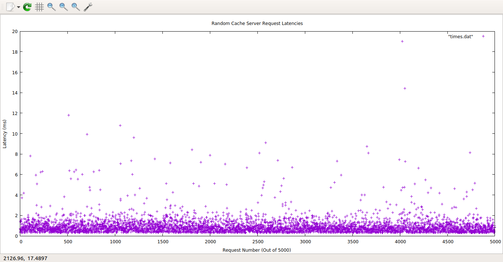

# HW5: Lies, statistics, and benchmarks
Arthur Lawson, Ian Jackson

## Part 1:

Adhering to the ratios observed in the Memcached workload paper, our implementation created "common keys", which populated 50% of the total key pool and were accessed with a probability of 99% and "rare keys," which took up the other 50% of the total key pool and were accessed with a probability of 1%.

### Warm Cache Implementation
We originally called warm_cache inside of generate, but moved it into baselines.cc to make sure that it was only called once and didn't delay the overall time of testing.
We started each workload with a ready-warm cache, which was filled with # keys = n_requests / 3, to make sure that we had enough keys to handle the ratio of delete requests to set requests. This prevented the key pools from becoming completely emptied by delete requests.

### Testing Parameters:

84% Hit Rate Achieved with 926000 bytes cache memory, 5000 requests

## Part 2:

We tested the baselines by inputting the parameters that gave us 84% hit rate in Part 1 (926000 bytes cache memory, 5000 requests), and found a 95% percentile of 1.94ms and a rate of 90.9 requests/second.

The array of latencies for each request was ofstreamed into a file, "times.dat," and gnuplotted as a scatter plot, the output of which was saved as latency_plot.png (below).

## Bugs, Leaks, and Warnings
Sometimes, if maxmem is too big a number, running the server leads to an error. This could be due to the fact that Cache::size_type is a u_int32 and cannot take numbers over 4294967294.

## Contributions / Sources
Design adopted from assigned Memcache Readings (Nishtala et al. 2013, Atikoglu et al., 2012).
